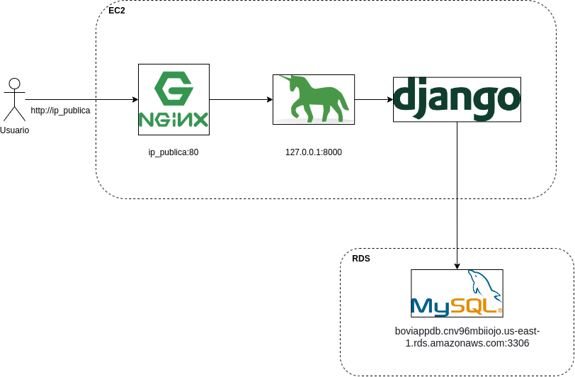
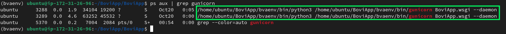

# Manual infraestructura

Para el servidor web usamos EC2 de AWS, para el servidor de BD usamos RDS también de AWS; el diseño del despliegue es como sigue



## Server

OS: Ubuntu 22.04

### Conectarse al server

Para conectarse al servidor usamos ssh, escribir el siguiente comando (En windows usar PowerShell, no CMD. En UNIX usar cualquier shell)

```ssh -i boviapp-key.pem ubuntu@ip_publica_del_server```

La IP pública del server cambia cada vez que se apaga. El archivo .pem es la llave privada y por nada del mundo deberíamos compartirlo con alguien externo, se encuentra en la carpeta del grupo que no tiene acceso del profe.

**Nota:** Entrar a la carpeta del proyecto con ```cd ~/BoviApp/BoviApp```, se asumen todos los comandos a continuación ejecutados desde aquí

### Encender y apagar BoviApp (gunicorn)

Para manejar gunicorn toca activar el entorno virtual (```source ../bvenv/bin/activate```)

#### Encender servidor web

```gunicorn BoviApp.wsgi --daemon```

#### Apagar servidor web

```killall gunicorn```

#### Revisar si el servidor web está corriendo

```ps aux | grep gunicorn``` debería mostrar el siguiente resultado



otra forma sería revisar los logs de acceso

```tail -f /var/log/nginx/access.log```

```tail -f``` se cierra con Ctrl+C

### Encender y apagar el proxy inverso (NGINX)

NGINX suele estar encendido siempre, incluso después de reiniciar el OS

#### Encender, Apagar y Reiniciar NGINX

```sudo systemctl start nginx```

cambiar ```start``` por ```stop``` o ```restart```

#### Revisar si NGINX está corriendo

```systemctl status nginx```

### Static files

Al añadir nuevos archivos static como css, js, etc, apagar gunicorn y ejecutar lo siguiente

```python manage.py collectstatic```

### FAQ y comentarios adicionales

**Error 502 Bad Gateway:** El NGINX está corriendo pero Gunicorn no. Encender Gunicorn

**Error 400  Bad Request:** BoviApp está corriendo pero no acepta peticiones. Agregar la IP Pública al arreglo ALLOWED_HOSTS en ``settings.py``

**Nota:** Hacer algún cambio requiere reiniciar el gunicorn
